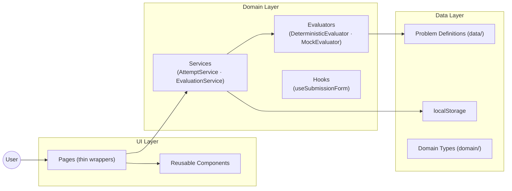
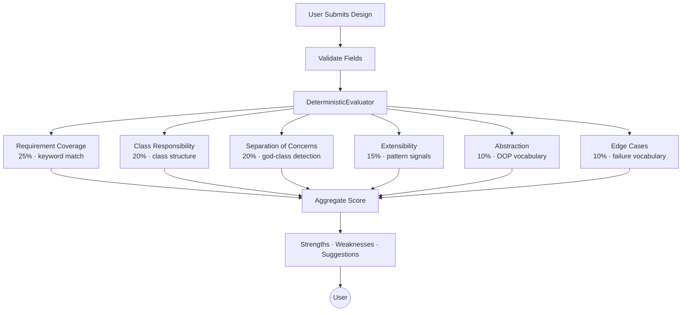

<div align="center">

# 🧪 DesignLab

### Practice Low-Level Design. Get Feedback. Improve Your Design.

*A focused, browser-native platform for mastering Low-Level Design interviews through structured submission, deterministic evaluation, and iterative improvement.*

<br>

<p align="center">
  <a href="https://your-demo-url.vercel.app/">
    
  </a>
</p>


<br>

<p align="center">
  
  
  
  
</p>

<p align="center">
  
  
</p>

</div>

---

## 🌟 Overview

**DesignLab** is a browser-native learning platform built for software developers who want to get serious about Low-Level Design (LLD) interviews.

Unlike resources that hand you a model solution, DesignLab puts you in the driver's seat. You pick a problem, think it through, submit a structured design, get **explainable category-by-category feedback**, and iterate until you're confident.

No API key. No server. No sign-up. Just you and the design problem.

---

## ✨ Features

### 🏗️ LLD Problem Library
- 6 curated, production-quality problems with full requirements and thinking prompts
- Custom problem creator — bring your own challenge and practice it immediately
- Problems: **Parking Lot · Vending Machine · Elevator System · Library Management · Chess · Custom**

---

### 📋 Structured Submission
- Guided sections keep your thinking organized: **Approach · Class Design · Pseudocode · Trade-offs**
- Auto-save every 30 seconds — drafts never get lost
- Resume incomplete attempts anytime

---

### 🧠 Deterministic Evaluation Engine
- Scores across **6 weighted categories** with no external dependencies
- Every score comes with a textual explanation of *why* — not just a number
- Consistent, offline, and explainable

---

### 📈 Progress Tracking
- Full attempt history with scores, dates, and retry links
- Aggregate stats: total attempts, problems tried, average and best scores
- Delete individual attempts or clear all history

---

## 🚀 Why DesignLab?

LLD interviews are among the hardest to prepare for — not because the concepts are complex, but because there is no single correct answer. Most resources either show you a polished solution without building your design intuition, or give feedback too vague to act on.

DesignLab is different:

- **Structured** — you submit in sections, not a free-text blob
- **Explainable** — feedback tells you *why* your design scored the way it did
- **Iterative** — every attempt is logged so you can track real improvement over time

---

## 🛠️ Tech Stack

<div align="center">

### Frontend

<div align="center">

<table>
  <tr>
    <td align="center" width="90">
      <br/>
      <sub><b>React</b></sub>
    </td>
    <td align="center" width="90">
      <br/>
      <sub><b>TypeScript</b></sub>
    </td>
    <td align="center" width="90">
      <br/>
      <sub><b>Vite</b></sub>
    </td>
    <td align="center" width="90">
      <br/>
      <sub><b>Tailwind CSS</b></sub>
    </td>
    <td align="center" width="90">
      <br/>
      <sub><b>Vitest</b></sub>
    </td>
  </tr>
</table>

</div>

### Storage & Testing


</div>

---

## 🏗️ Architecture

DesignLab follows a strict **separation of concerns** — UI components contain zero business logic. All domain behaviour lives in `services/` and `evaluators/`, with pages acting as thin wrappers.



---

## 🧠 Evaluation Pipeline

Every submission flows through a structured scoring pipeline:



---

## 🔍 Evaluation Scoring

| Category | Weight | How It's Measured |
|---|---|---|
| 📌 Requirement Coverage | 25% | Keyword matching against problem-specific domain vocabulary |
| 🏛️ Class Responsibility | 20% | Class count, completeness, methods, relationships |
| ✂️ Separation of Concerns | 20% | God-class detection, service/strategy layer presence |
| 🔌 Extensibility | 15% | Strategy, interface, and abstract pattern signals |
| 🧩 Abstraction | 10% | OOP abstraction vocabulary presence |
| 🛡️ Edge Cases | 10% | Failure scenario vocabulary (null, exception, concurrent…) |

> A **Mock Evaluator** acts as an automatic fallback — if the deterministic evaluator fails, it mirrors the same output structure so the UI always works.

---

## 🔄 User Flow

```
Browse Problems
  → (or) Create a Custom Problem
    → Open Problem Detail
      (requirements · assumptions · thinking prompts)
        → Start Attempt
          → Fill: Approach / Class Design / Pseudocode / Trade-offs
            → Auto-saved as Draft every 30 seconds
              → Submit & Evaluate
                → Feedback Page
                  (score · category breakdown · strengths · weaknesses · suggestions)
                    → Try Again → new attempt on same problem

History Page
  → View all past attempts, scores, timestamps
  → Delete individual attempts or clear all
```

---

## 📂 Project Structure

```text
designlab/
│
├── src/
│   ├── domain/         # Core TypeScript types (Problem, Attempt, Submission, Evaluation)
│   ├── data/           # Seeded problem definitions (6 problems with requirements, prompts, keywords)
│   ├── evaluators/     # Evaluator interface, DeterministicEvaluator, MockEvaluator
│   ├── services/       # AttemptService (localStorage CRUD) + EvaluationService (orchestration)
│   ├── hooks/          # useSubmissionForm (form state management)
│   ├── components/     # Nav, Badge, ScoreBar, LoadingSpinner, ErrorMessage, EmptyState
│   ├── pages/          # Home, Problems, ProblemDetail, Practice, Feedback, History, CreateProblem
│   └── utils/          # validation.ts
│
├── src/test/           # Vitest setup
├── package.json
└── vite.config.ts
```

---

## ⚡ Getting Started

```bash
# Clone the repository
git clone https://github.com/your-username/designlab.git
cd designlab

# Install dependencies
npm install

# Start development server
npm run dev
# → http://localhost:5173
```

No environment variables required. The platform runs entirely in the browser.

```bash
# Run tests
npm test

# Build for production
npm run build
```

---

## 🧪 Test Coverage

43 tests across 4 test files:

| File | Tests | What's Covered |
|---|---|---|
| `DeterministicEvaluator.test.ts` | 17 | Scoring logic, feedback quality, edge inputs |
| `AttemptService.test.ts` | 11 | CRUD, persistence, stats, deletion |
| `EvaluationService.test.ts` | 6 | Orchestration, fallback, failure handling |
| `validation.test.ts` | 9 | Field validation, empty detection |

---

## 📦 Core Modules

| Module | Responsibility |
|---|---|
| 🏛️ Problem Library | 6 curated problems + custom creator |
| 📋 Submission Form | Structured 4-section design submission |
| 🧠 Evaluator | Deterministic scoring with explanations |
| 📁 Attempt Service | localStorage CRUD + history management |
| 📊 Progress Stats | Aggregate performance tracking |
| 🔄 Draft Auto-Save | 30-second interval save to localStorage |

---

## ⚖️ Trade-offs & Decisions

| Decision | Reasoning |
|---|---|
| **localStorage over backend** | No infrastructure overhead for a prototype; sufficient for single-device use |
| **Rule-based evaluation** | Works fully offline. Deterministic and explainable — no LLM dependency |
| **6 curated problems** | Quality over quantity — each has full requirements, prompts, and evaluation keywords |
| **SPA architecture** | Simplest structure for a focused, single-journey learner experience |
| **No undo in form** | Out of scope; drafts auto-save every 30 seconds as the safety net |

---

## ⚠️ Known Limitations

- Evaluation is **keyword-based, not semantic** — a well-designed solution using uncommon terminology may score lower than expected.
- **localStorage is browser-local** (~5 MB limit). History does not sync across devices.
- **Draft save is interval-based** (every 30 seconds). A hard crash could lose up to 30 seconds of unsaved work.

---

## 🛡️ Engineering Practices

- **Domain-driven architecture** — types, evaluators, services, and UI layers are strictly separated
- **Test-first evaluator** — scoring logic is unit-tested before being wired to the UI
- **Zero external AI dependencies** — the evaluation engine runs fully offline
- **Component-driven UI** — reusable primitives (Badge, ScoreBar, LoadingSpinner) compose all pages
- **Clean Code** — pages are thin wrappers; all logic lives in the domain layer

---

## 🗺️ Roadmap

- [ ] AI-powered semantic evaluation (optional LLM mode)
- [ ] Side-by-side design comparison
- [ ] Export attempts as PDF report
- [ ] Community problem library
- [ ] Spaced repetition for weak categories
- [ ] Design diagram canvas (whiteboard mode)
- [ ] Team / peer review mode

---

## 🤝 Contributing

Contributions are welcome — especially new LLD problems with well-defined requirements and evaluation keywords.

```bash
# Fork the repository
# Create a new branch
git checkout -b feature/your-feature

# Commit your changes
git commit -m "feat: add your feature"

# Push and open a Pull Request
git push origin feature/your-feature
```

Please keep business logic in `services/` and `evaluators/` — not in page or component files.


---

<div align="center">

## ⭐ Support the Project

If DesignLab helped you prep for your interviews:

**Star the repo · Fork it · Report bugs · Suggest problems**

Every contribution makes the platform better for the next developer.

---

**DesignLab — Because design thinking is a skill, not a secret.**


</div>
